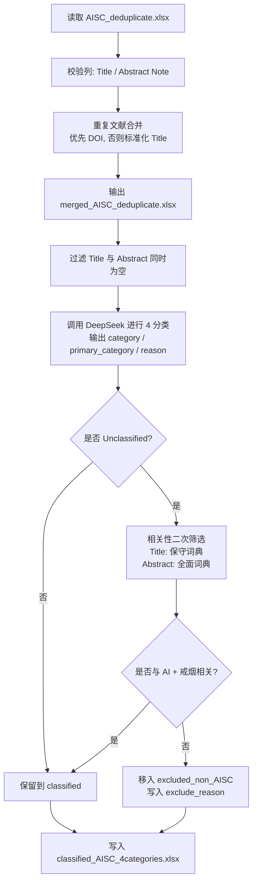

# AISC 文献分类流程说明

本项目用于对文献进行 **AI in Smoking Cessation (AISC)** 方向的自动分类，基于 DeepSeek API（OpenAI SDK 兼容方式）实现 4 大类多标签分类，并对 `Unclassified` 结果做二次相关性筛选。

## 文件结构

- `AISC_main_openai_4categories.py`：主流程脚本（读取 Excel、去重、分类、后处理、导出）。
- `AISC_prompt_config_openai_4categories.py`：提示词与模型调用、输出解析逻辑。
- `AISC_deduplicate.xlsx`：输入数据文件（默认路径）。

## 分类标签（4 大类）

- `Diagnosis`
- `Intervention`
- `Monitor`
- `Predict`

模型输出字段：
- `category`（可多标签）
- `primary_category`（单主标签）
- `reason`（分类理由）

## 运行前准备

1. 安装依赖（至少需要）：
   - `pandas`
   - `openpyxl`
   - `openai`

2. 配置环境变量：
   - `DEEPSEEK_API_KEY`

3. 确认输入文件与列名：
   - 输入文件默认：`AISC_deduplicate.xlsx`
   - 必需列：`Title`、`Abstract Note`

## 执行方式

在当前目录运行：

```bash
python AISC_main_openai_4categories.py
```

## 主流程（端到端）

1. 读取输入 Excel。
2. 校验必需列：`Title`、`Abstract Note`。
3. **重复文献合并**：
   - 优先按 `DOI` 合并（标准化 DOI）；
   - DOI 缺失时按标准化 `Title` 合并；
   - `Title`/`Abstract Note` 取更完整文本，其它列做去重拼接。
4. 输出去重中间文件：`merged_AISC_deduplicate.xlsx`。
5. 过滤标题和摘要同时为空的记录。
6. 调用大模型进行 4 分类，得到 `category / primary_category / reason`。
7. **仅对 `Unclassified` 记录做相关性二次筛选**：
   - 判断是否同时与 **AI** 和 **戒烟** 相关；
   - `Title` 使用保守词典（高精度）；
   - `Abstract Note` 使用全面词典（高召回）；
   - 对不相关的 `Unclassified` 记录从主结果剔除，并记录剔除原因。
8. 输出最终结果 Excel（同一文件多 sheet）。

## 流程图



## 输出结果

最终输出文件：`classified_AISC_4categories.xlsx`

包含两个 sheet：

- `classified`：最终保留的分类结果（含原始字段 + `category` + `primary_category` + `reason`）。
- `excluded_non_AISC`：仅来自 `Unclassified` 的剔除记录（含 `exclude_reason`）。

## 说明与建议

- 当前策略是“**只筛 `Unclassified`**”，用于降低误删已成功分类文献的风险。
- 若后续要更严格筛选，可改为全局筛选，但建议先做抽样评估再切换。
- 若 `Unclassified` 比例偏高，请优先检查：
  - API 调用是否稳定（密钥、网络、限流）；
  - 文献本身是否与 AISC 方向弱相关；
  - 提示词和关键词词典覆盖是否需要继续扩展。
